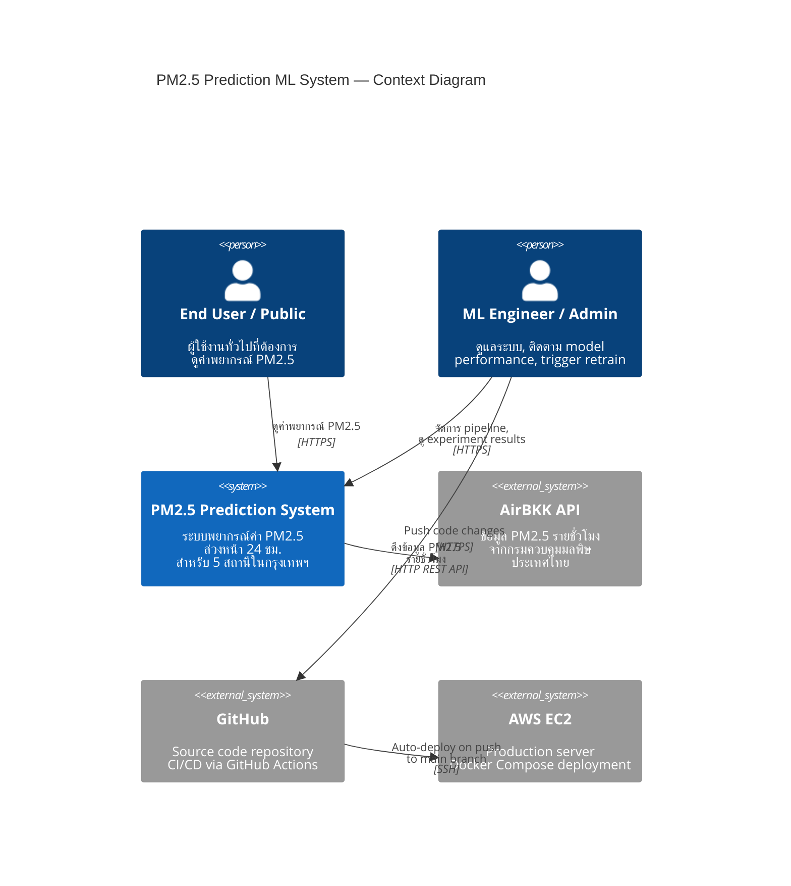
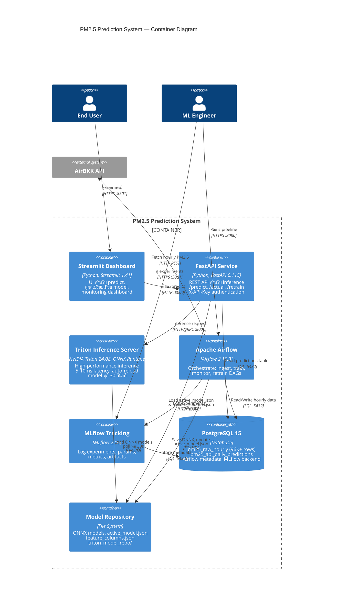
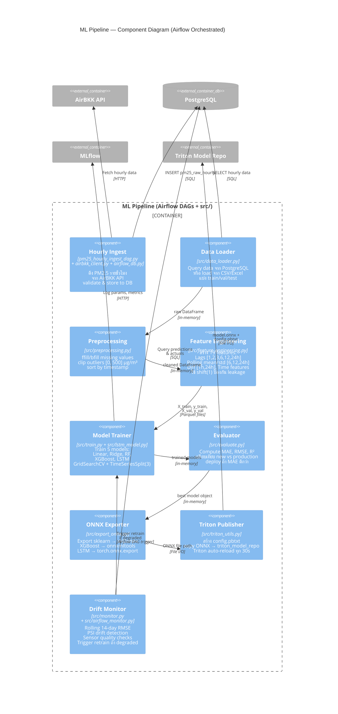
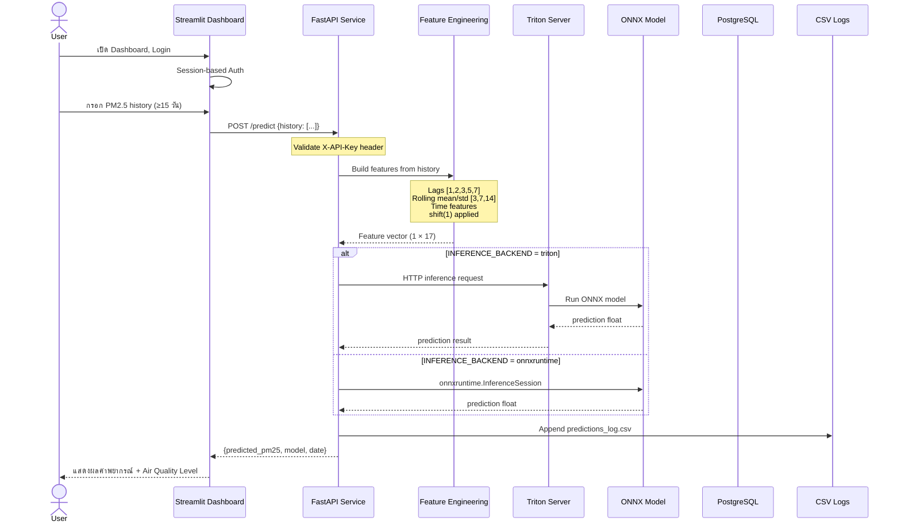
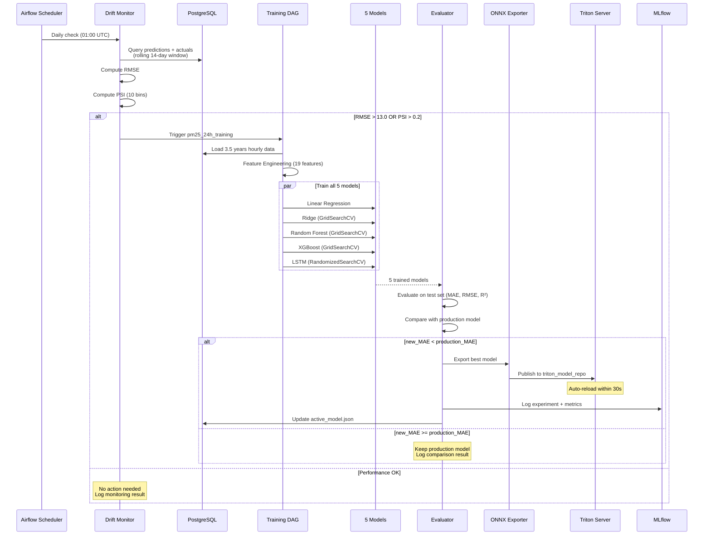
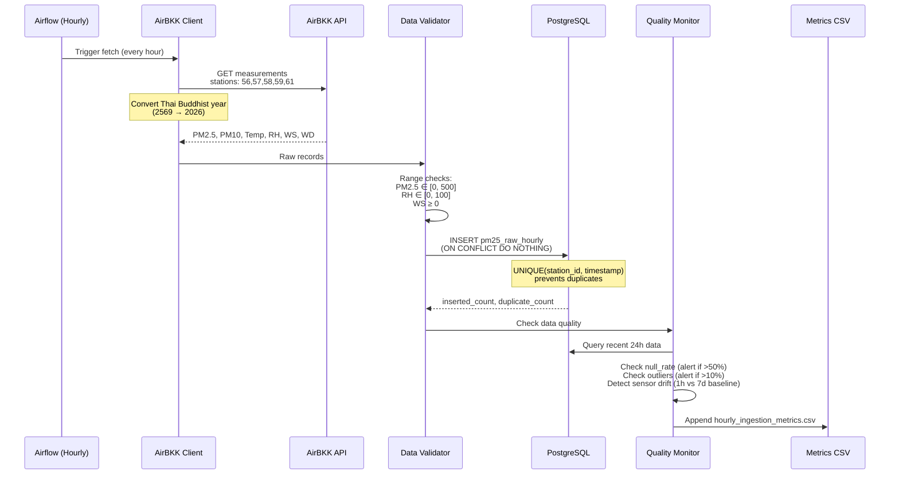
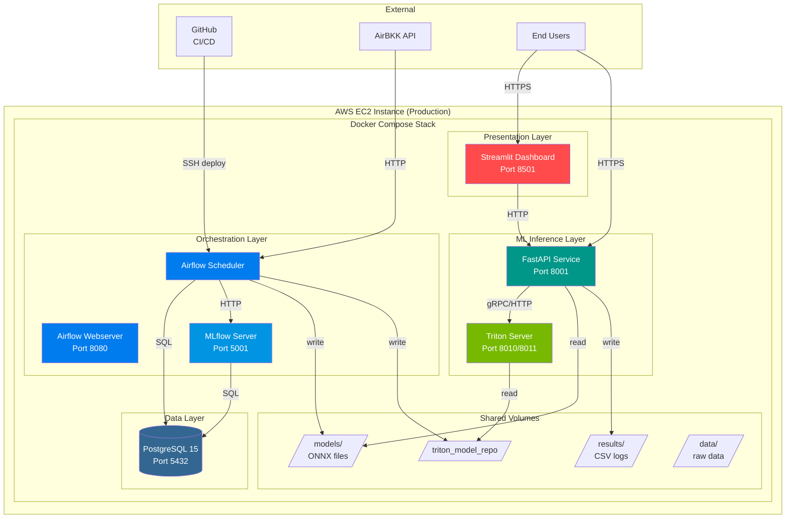

# C4 Architecture — PM2.5 Prediction ML System

## Overview

ระบบทำนายค่าฝุ่น PM2.5 ล่วงหน้า 24 ชั่วโมง สำหรับ 5 สถานีตรวจวัดในกรุงเทพฯ (Station 56, 57, 58, 59, 61) โดยใช้ข้อมูลรายชั่วโมงจาก AirBKK API ผ่านระบบ ML Pipeline อัตโนมัติ พร้อม auto-retrain เมื่อตรวจพบ drift

---

## Level 1: Context Diagram

แสดงขอบเขตของระบบ ผู้ใช้งาน และระบบภายนอกที่เกี่ยวข้อง

### Design Decisions — Level 1:
- **AirBKK API เป็น single data source** — ใช้ข้อมูลจากแหล่งเดียวที่เป็น official ของไทย ทำให้ข้อมูลมี consistency
- **AWS EC2 deployment** — เลือก EC2 เพราะต้องรัน Triton Inference Server ที่ต้องการ GPU/CPU แรง ไม่เหมาะกับ serverless
- **GitHub Actions CI/CD** — auto-deploy เมื่อ push main ลดขั้นตอน manual deployment

---

## Level 2: Container Diagram

แสดง components หลักของระบบ และ technology ที่ใช้

### Design Decisions — Level 2:
- **Triton Inference Server แยกจาก FastAPI** — Triton จัดการ batching, concurrency, model versioning ได้ดีกว่า onnxruntime ตรงๆ; FastAPI ทำหน้าที่เป็น API gateway + feature engineering
- **ONNX-only deployment** — ทุก model (sklearn, XGBoost, PyTorch LSTM) ถูก export เป็น ONNX ทำให้ inference ไม่ต้องพึ่ง training framework
- **PostgreSQL shared instance** — Airflow metadata, MLflow backend, และ time-series data อยู่ DB เดียวกัน (แยก schema) ลด operational overhead
- **File-based model repository** — ใช้ file system แทน model registry เพราะ Triton poll จาก directory ตรงๆ; active_model.json เป็น pointer ไป ONNX file ปัจจุบัน
- **MLflow สำหรับ experiment tracking** — ไม่ได้ใช้ MLflow Model Registry เพราะใช้ ONNX + Triton path แทน

---

## Level 3: Component Diagram (ML Pipeline Container)

แสดง internal structure ของ ML pipeline ที่ orchestrate โดย Airflow

### Design Decisions — Level 3:
- **5 competing models** — Linear, Ridge, RF, XGBoost, LSTM ถูก train ทุกครั้ง แล้วเลือก model ที่ MAE ต่ำสุดบน test set; ทำให้ระบบ adaptive ต่อ data pattern ที่เปลี่ยน
- **TimeSeriesSplit(n_splits=3)** — ใช้แทน random k-fold เพื่อรักษาลำดับเวลา ป้องกัน data leakage
- **shift(1) on all features** — critical design choice เพื่อไม่ให้ feature ใช้ข้อมูลของวันที่จะ predict
- **PSI (Population Stability Index)** — ใช้วัด distribution shift ระหว่าง predicted vs actual; PSI > 0.2 = significant drift → trigger retrain
- **ONNX export per model type** — แต่ละ framework มี export path ต่างกัน: sklearn ใช้ skl2onnx, XGBoost ใช้ onnxmltools, LSTM ใช้ torch.onnx.export
- **Versioned ONNX files** — ไม่ลบ model เก่า เก็บ `{model}_{train_start}_{train_end}.onnx` สำหรับ rollback

---

## Level 4: Code-Level Diagram (ML Training & Inference)

### 4a: Training Flow — Class & Function Level

```mermaid
classDiagram
    direction LR

    class DataLoader {
        +load_config(path) dict
        +load_station_data(file, sheet, station_id) DataFrame
        +load_train_test_data(config) tuple~DataFrame~
    }

    class Preprocessing {
        +handle_missing_values(df, method) DataFrame
        +remove_outliers(df, lower, upper) DataFrame
        +preprocess_pipeline(df, fill_method) DataFrame
    }

    class FeatureEngineering {
        +create_lag_features(df, lag_days) DataFrame
        +create_rolling_features(df, windows) DataFrame
        +create_time_features(df) DataFrame
        +create_change_features(df) DataFrame
        +build_features(df, lag_days, windows) DataFrame
        +get_feature_columns(df) list~str~
    }

    class ModelTrainer {
        +train_all_models(config) dict
        -_train_linear(X, y) LinearRegression
        -_train_ridge(X, y, params) Ridge
        -_train_rf(X, y, params) RandomForest
        -_train_xgb(X, y, params) XGBRegressor
        -_train_lstm(X, y, params) NeuralNetRegressor
    }

    class LSTMNet {
        -lstm: LSTM(input=19, hidden=units)
        -dropout: Dropout(p)
        -fc1: Linear(units, 32)
        -fc2: Linear(32, 1)
        +forward(x) Tensor
    }

    class Evaluator {
        +evaluate_model(y_true, y_pred) dict
        +print_metrics(name, metrics) void
        +compare_models(path) DataFrame
    }

    class OnnxExporter {
        +export_sklearn(model, name, dir, n_feat) str
        +export_xgboost(model, dir, n_feat) str
        +export_lstm(model, dir, n_feat) str
    }

    class TritonPublisher {
        +publish_to_triton(onnx_path, repo, is_lstm) void
        -_generate_config_pbtxt(model_name, inputs, outputs) str
    }

    class DriftMonitor {
        +compute_psi(expected, actual, bins) float
        +psi_status(psi) str
        +run_monitoring(config) dict
    }

    DataLoader --> Preprocessing : raw data
    Preprocessing --> FeatureEngineering : cleaned data
    FeatureEngineering --> ModelTrainer : X, y matrices
    ModelTrainer --> LSTMNet : LSTM training
    ModelTrainer --> Evaluator : trained models
    Evaluator --> OnnxExporter : best model
    OnnxExporter --> TritonPublisher : ONNX file
    DriftMonitor --> ModelTrainer : trigger retrain
```

### 4b: Inference Flow — Sequence Diagram

### 4c: Auto-Retrain Flow — Sequence Diagram

### 4d: Data Ingestion Flow

### 4e: System Deployment Architecture

---

## Trade-offs Summary

| Decision | Benefit | Trade-off |
|----------|---------|-----------|
| ONNX-only inference | Framework-agnostic, fast, portable | ต้อง export ทุก model type ต่างกัน |
| Triton Server | Low latency (5-10ms), auto-batching | เพิ่ม complexity, ต้องจัดการ model repo |
| 5 models compete | Adaptive — เลือก model ที่ดีที่สุดตาม data | Training ช้ากว่า (15-20 ชม. ต่อ 5 สถานี) |
| PostgreSQL shared | ลด ops overhead, single backup point | ถ้า DB ล่ม ทั้งระบบหยุด |
| shift(1) on features | ป้องกัน data leakage 100% | สูญเสีย 1 row ต่อ feature |
| PSI + MAE monitoring | จับได้ทั้ง distribution drift และ accuracy drop | ต้องมี actual data มา match |
| Docker Compose | Deploy ง่าย, reproducible | ไม่ scale horizontally เหมือน K8s |
| File-based model versioning | เรียบง่าย, Triton poll ตรงๆ | ไม่มี model registry UI |
