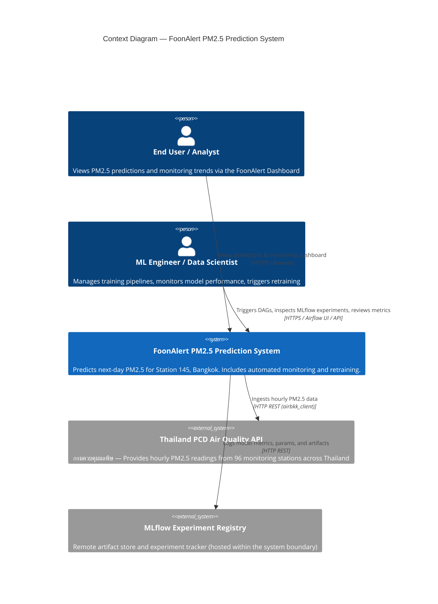
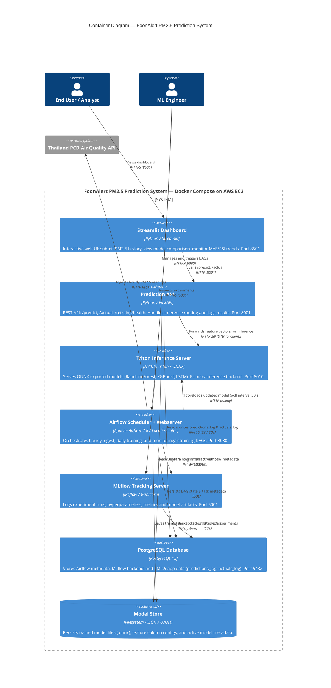
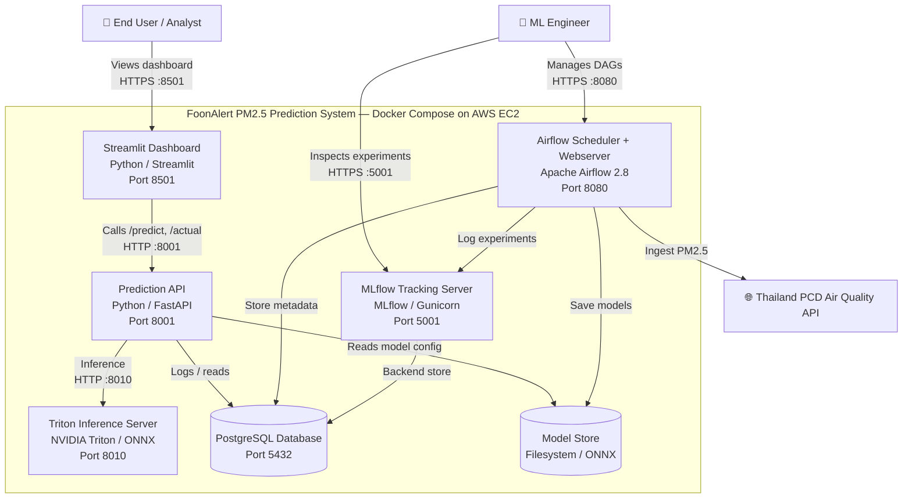
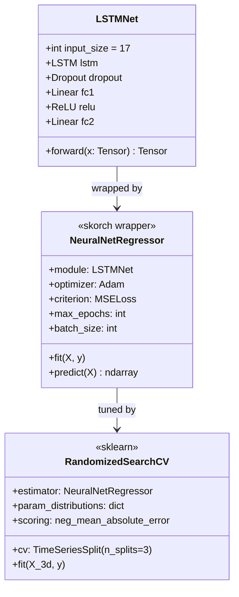
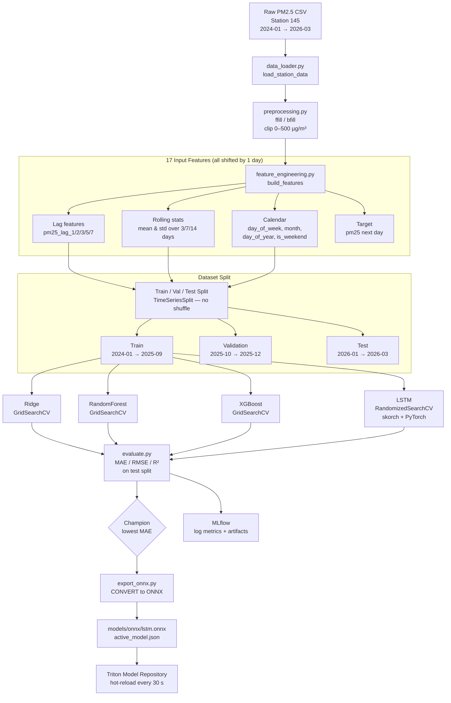
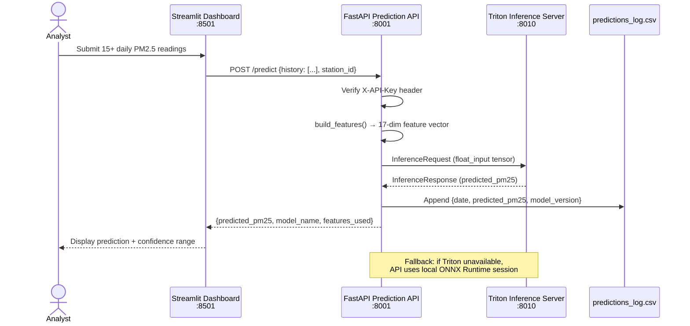
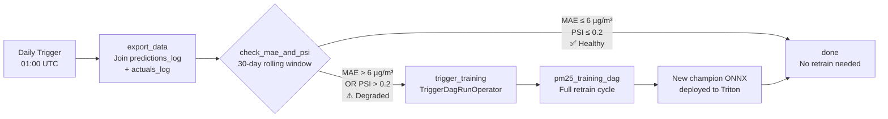

# Part 1: System Architecture Overview — C4 Model

**System:** FoonAlert PM2.5 Prediction System  
**Deployment:** `43.209.207.187` (AWS EC2)  
**Goal:** Predict next-day (24-hour) PM2.5 concentration (µg/m³) for Station 145 — Bangkhuntien, Bangkok

---

## Level 1 — Context Diagram

> System scope, users, and external systems.

**Design Decisions:**
- The system is designed as a self-contained ML platform. MLflow is deployed inside the same Docker Compose stack rather than an external SaaS to avoid data egress costs and keep experiment history reproducible.
- Data ingestion is decoupled from prediction via Airflow DAGs, so the external PCD API outage does not block inference.

---

## Level 2 — Container Diagram

> Major system components and technologies.

**Design Decisions & Trade-offs:**

| Decision | Rationale |
|---|---|
| Triton as primary inference backend | Handles ONNX models uniformly; supports GPU acceleration for LSTM without code changes. Falls back to local ONNX Runtime if Triton is unavailable. |
| LocalExecutor (no Celery/k8s) | Simpler ops for a single-node deployment; sufficient for daily training cadence. |
| Shared PostgreSQL | Reduces infrastructure cost; Airflow, MLflow, and app DB coexist in separate schemas. |
| ONNX export for all models | Decouples training framework (sklearn, XGBoost, PyTorch) from the runtime; Triton can serve all formats via a single interface. |

---

## Level 3 — Component Diagram (ML Pipeline Container)

> Internal structure of the Airflow ML Pipeline.

```mermaid
flowchart LR
    %% ── External Systems (right column) ────────────────────────────
    PCD(["🌐 PCD API\nhourly PM2.5"])
    PG[("🛢 PostgreSQL\npm25_raw\npredictions_log")]
    MLFLOW(["📊 MLflow\nTracking Server"])
    TRITON(["⚡ Triton\nInference :8010"])

    %% ── DAG 1: Hourly Ingest ───────────────────────────────────────
    subgraph INGEST["🕐 DAG 1 — pm25_hourly_ingest  (every hour)"]
        direction LR
        I1["airbkk_client.py\nPoll PCD API"]
        I2["Validate & parse\nhourly PM2.5"]
        I3["INSERT to\npm25_raw table"]
        I1 --> I2 --> I3
    end

    %% ── DAG 2: Training Pipeline ───────────────────────────────────
    subgraph TRAIN["🏋️ DAG 2 — pm25_training_dag  (on-demand)"]
        direction LR
        T1["data_loader.py\nLoad data"]
        T2["preprocessing.py\nffill · clip 0–500"]
        T3["feature_engineering.py\n17 features · shift(1)"]
        T4["train.py\nRidge · RF · XGBoost\nLSTM (skorch)"]
        T5["evaluate.py\nMAE · RMSE · R²"]
        T6{"Champion\nlowest MAE"}
        T7["export_onnx.py\n→ models/onnx/"]
        T1 --> T2 --> T3 --> T4 --> T5 --> T6 --> T7
    end

    %% ── DAG 3: Monitoring & Auto-Retrain ───────────────────────────
    subgraph MONITOR["📈 DAG 3 — pm25_pipeline_dag  (daily 01:00 UTC)"]
        direction LR
        M1["export_data\nJoin pred + actual logs"]
        M2{"check_mae_and_psi\n30-day rolling window\nBranchPythonOperator"}
        M3["✅ done\nhealthy"]
        M4["⚠️ trigger_training\nTriggerDagRunOperator"]
        M1 --> M2
        M2 -- "MAE ≤ 6 & PSI ≤ 0.2" --> M3
        M2 -- "MAE > 6 OR PSI > 0.2" --> M4
    end

    %% ── Data / Trigger Connections ─────────────────────────────────
    PCD -- "GET hourly\nHTTP REST" --> I1
    I3 -- "SQL INSERT" --> PG
    T1 -- "Read\npm25_raw" --> PG
    T5 -- "Log metrics\n& artifacts" --> MLFLOW
    T7 -- "Write ONNX\nhot-reload 30s" --> TRITON
    M1 -- "Read\nlogs" --> PG
    M4 -- "Triggers\nretrain" --> TRAIN

    %% ── Styles ─────────────────────────────────────────────────────
    classDef ext fill:#f0f0f0,stroke:#999,color:#333,font-style:italic
    classDef db  fill:#dbeafe,stroke:#3b82f6,color:#1e3a8a
    classDef act fill:#d1fae5,stroke:#059669,color:#064e3b
    classDef dec fill:#fef3c7,stroke:#d97706,color:#78350f
    classDef trg fill:#fce7f3,stroke:#db2777,color:#831843

    class PCD,MLFLOW,TRITON ext
    class PG db
    class I1,I2,I3,T1,T2,T3,T4,T5,T7,M1,M3 act
    class T6,M2 dec
    class M4 trg
```

**Design Decisions:**

- **BranchPythonOperator** is used in `pm25_pipeline_dag` so Airflow skips downstream tasks cleanly when no retrain is needed — avoids false "failed" states.
- `shift(1)` applied to all rolling/lag features ensures no future data leaks into training.
- Champion model selection is metric-driven (lowest MAE on test split); ONNX export uses the same champion path for all algorithm families.

---

## Level 4 — Code-Level Diagram (ML Component)

> Key implementation structures inside the ML component.

### 4a. LSTM Model Architecture (`src/lstm_model.py`)

### 4b. Training Pipeline Data Flow (`src/train.py` + `src/feature_engineering.py`)

### 4c. Online Inference Flow (`src/api.py`)

### 4d. Monitoring & Auto-Retrain Flow (`dags/pm25_pipeline_dag.py`)

---

## Summary of Architecture Decisions

| Concern | Decision | Trade-off |
|---|---|---|
| **Inference latency** | Triton serves ONNX; FastAPI is stateless | Adds one network hop vs in-process inference, but enables horizontal scaling |
| **Model flexibility** | All models exported to ONNX | Loses PyTorch dynamic graph features; static input shape required |
| **Data leakage prevention** | `shift(1)` on all lag/rolling features | Slightly reduces short-term signal but is production-safe |
| **Retraining trigger** | Dual signal: MAE + PSI | PSI catches distribution shift before MAE degrades; may trigger unnecessary retrains |
| **Data split** | Strict temporal (no shuffle) | Realistic evaluation; smaller effective training set vs random split |
| **Auth** | API key header (`X-API-Key`) | Simple to implement; suitable for internal / dashboard-only calls |
